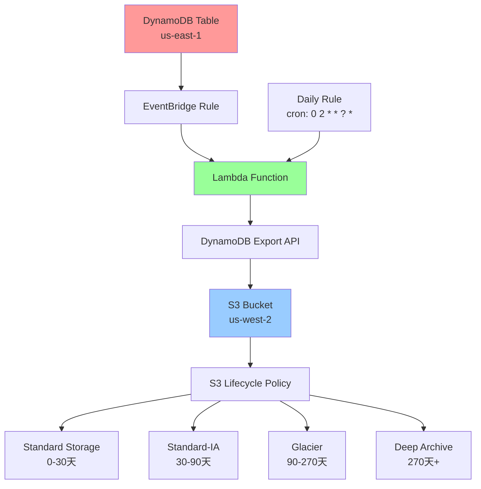
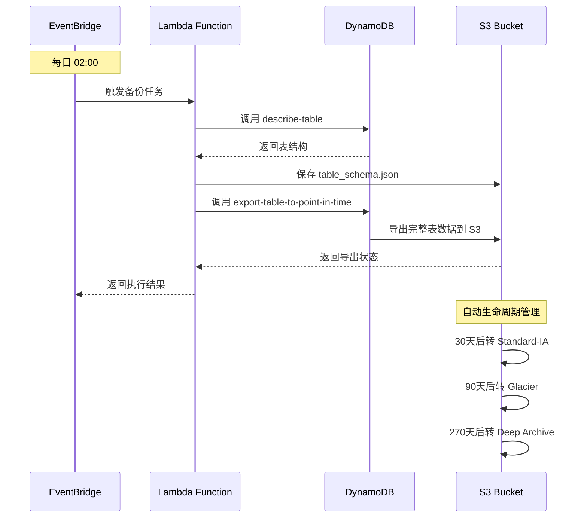
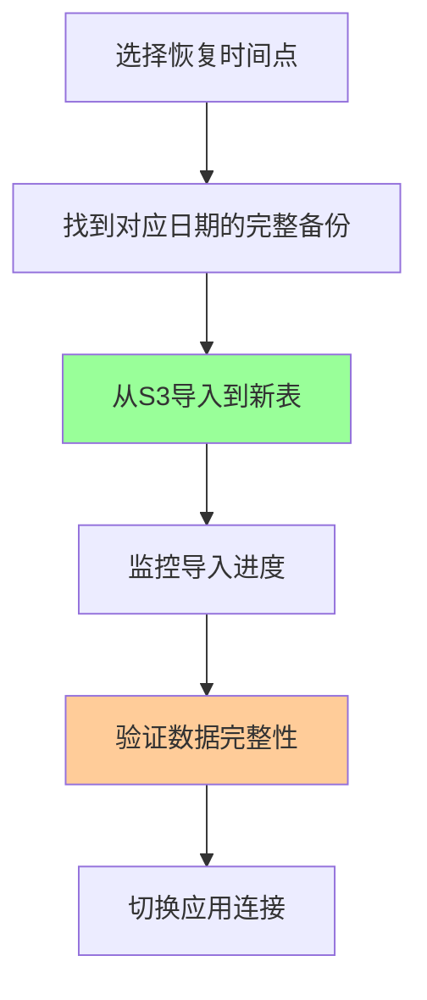
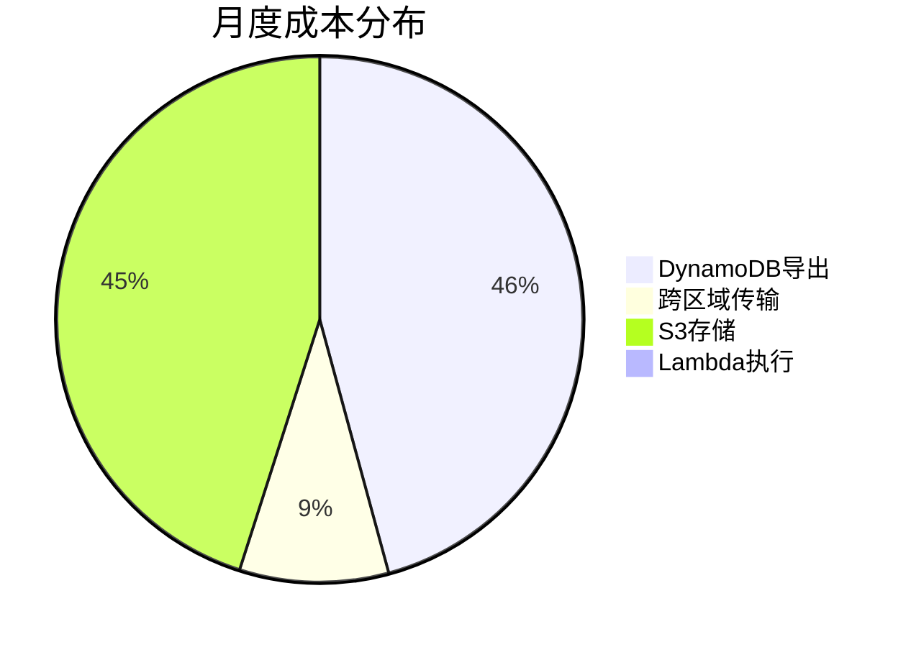

# DynamoDB自动备份方案

基于AWS Lambda和EventBridge的DynamoDB跨区域自动备份解决方案，支持多表每日完整备份到S3，自动生命周期管理，提供完整的灾难恢复能力。

## 方案概述

- **多表备份**: 支持同时备份多个DynamoDB表
- **每日完整备份**: 每天凌晨2点执行完整表导出
- **表结构自动备份**: 每次备份时自动保存表结构，恢复时无需手动配置
- **跨区域存储**: us-east-1 → us-west-2 S3
- **自动生命周期**: 30天后转IA，90天后转Glacier，270天后转Deep Archive
- **保留期限**: 730天（2年）后自动删除

**重要说明**：
- 每日完整备份确保可恢复到任意一天
- 最多丢失1天数据（从上次备份到故障时间）
- 跨区域存储提供额外的灾难恢复保障
- 每个表独立备份，互不影响

## 架构设计

### 系统架构图



### 备份流程图



### 存储生命周期

```
时间线（天）    存储类型              成本/GB/月
─────────────────────────────────────────────────
0-30天         Standard Storage      $0.023
30-90天        Standard-IA           $0.0125
90-270天       Glacier               $0.004
270-730天      Deep Archive          $0.00099
730天后        自动删除              -
```

**生命周期转换流程**：
```
Standard (30天) → Standard-IA (60天) → Glacier (180天) → Deep Archive (460天) → 删除
```

### 备份存储结构

```
s3://your-backup-bucket-name/
└── daily/                              # 每日完整备份
    ├── 2025/10/25/                    # 2025年10月25日
    │   ├── Table1/                    # 表1的备份
    │   │   ├── table_schema.json      # 表结构定义（自动备份）
    │   │   └── AWSDynamoDB/
    │   │       └── <EXPORT-ID>/       # DynamoDB导出ID
    │   │           ├── data/          # 实际数据文件
    │   │           └── manifest-*.json # 导出清单
    │   └── Table2/                    # 表2的备份
    │       ├── table_schema.json
    │       └── AWSDynamoDB/
    ├── 2025/10/26/                    # 2025年10月26日
    └── 2025/10/27/                    # 2025年10月27日
```

**重要说明**：
- 每次备份自动保存表结构到table_schema.json
- DynamoDB导出会自动创建AWSDynamoDB/<EXPORT-ID>/目录结构
- 恢复时优先使用备份中的表结构，回退到本地table_schema.json
- restore.py会自动处理路径查找

## 快速开始

### 前置条件

1. **启用DynamoDB PITR**
```bash
# 为每个表启用PITR
aws dynamodb update-continuous-backups \
    --table-name YOUR_TABLE_1 \
    --point-in-time-recovery-specification PointInTimeRecoveryEnabled=True \
    --region us-east-1

aws dynamodb update-continuous-backups \
    --table-name YOUR_TABLE_2 \
    --point-in-time-recovery-specification PointInTimeRecoveryEnabled=True \
    --region us-east-1
```

2. **创建S3存储桶**
```bash
aws s3 mb s3://your-backup-bucket-name --region us-west-2
```

### 一键部署

1. **修改配置**
编辑 `deploy.sh` 中的变量:
```bash
# 多表配置：逗号分隔的表ARN列表
TABLE_ARNS="arn:aws:dynamodb:us-east-1:YOUR_ACCOUNT:table/YOUR_TABLE_1,arn:aws:dynamodb:us-east-1:YOUR_ACCOUNT:table/YOUR_TABLE_2"
# 用于权限配置的表名列表（空格分隔）
TABLE_NAMES="YOUR_TABLE_1 YOUR_TABLE_2"
S3_BUCKET="your-backup-bucket-name"
ACCOUNT_ID="YOUR_ACCOUNT"
```

2. **执行部署**
```bash
chmod +x deploy.sh
./deploy.sh
```

3. **配置S3生命周期**
```bash
aws s3api put-bucket-lifecycle-configuration \
    --bucket your-backup-bucket-name \
    --lifecycle-configuration file://s3-lifecycle.json
```

4. **导出表结构（可选）**
```bash
python export_table_schema.py YOUR_TABLE us-east-1
```

**说明**：Lambda函数会在每次备份时自动保存表结构到S3（与数据一起备份），此步骤仅用于本地备份参考。恢复时会自动从S3备份中读取表结构，无需手动维护。

## 使用指南

### 监控备份状态
```bash
python monitor.py
```

### 手动触发备份
```bash
python monitor.py backup
```

## 数据恢复

### 前置条件

**1. 用户IAM权限配置**

执行restore.py的用户或角色需要以下权限：

```bash
# 创建恢复操作所需的IAM策略
aws iam put-user-policy \
    --user-name YOUR_USER \
    --policy-name DynamoDBRestorePolicy \
    --policy-document '{
  "Version": "2012-10-17",
  "Statement": [
    {
      "Effect": "Allow",
      "Action": [
        "dynamodb:ImportTable",
        "dynamodb:DescribeImport",
        "dynamodb:ListImports"
      ],
      "Resource": "arn:aws:dynamodb:*:YOUR_ACCOUNT:table/*"
    },
    {
      "Effect": "Allow",
      "Action": [
        "s3:GetObject",
        "s3:ListBucket"
      ],
      "Resource": [
        "arn:aws:s3:::your-backup-bucket-name",
        "arn:aws:s3:::your-backup-bucket-name/*"
      ]
    },
    {
      "Effect": "Allow",
      "Action": [
        "logs:CreateLogGroup",
        "logs:CreateLogStream",
        "logs:PutLogEvents"
      ],
      "Resource": "arn:aws:logs:*:YOUR_ACCOUNT:log-group:/aws-dynamodb/*"
    }
  ]
}'
```

**重要说明**：
- Resource中的`*`表示支持任意区域恢复
- 如果只恢复到特定区域，可以将`*`替换为具体区域（如us-west-2）
- S3桶必须允许跨区域访问

**2. 导出表结构（可选）**

Lambda函数会在每次备份时自动保存表结构到S3。如果需要本地备份，可以手动导出：

```bash
python export_table_schema.py YOUR_TABLE us-east-1
```

这会生成table_schema.json文件作为本地备份。

### 恢复流程图



### 恢复命令

**列出可用备份**
```bash
# 列出所有表的备份
python restore.py list

# 列出指定表的备份
python restore.py list MyTable
```

**完整恢复**
```bash
# 恢复到us-west-2（使用最新备份）
python restore.py restore MyTable us-west-2

# 恢复指定日期的备份
python restore.py restore MyTable us-west-2 2025/10/26
```

**跨区域恢复**
```bash
# 恢复到us-east-1
python restore.py restore MyTable us-east-1

# 恢复到eu-west-1
python restore.py restore MyTable eu-west-1
```

**CLI直接导入**
```bash
# 注意：需要指向AWSDynamoDB/<EXPORT-ID>/data/目录
aws dynamodb import-table \
    --s3-bucket-source S3Bucket=your-backup-bucket-name,S3KeyPrefix=daily/2025/10/26/MyTable/AWSDynamoDB/<EXPORT-ID>/data/ \
    --input-format DYNAMODB_JSON \
    --table-creation-parameters file://table_schema.json \
    --region us-west-2
```

### 恢复注意事项

#### 重要限制
- **只能导入到新表**：AWS不支持导入到现有表
- **跨区域支持**：可以从us-west-2的S3恢复到任意区域
- **格式要求**：备份格式为DynamoDB JSON，完全兼容
- **表结构自动备份**：Lambda函数每次备份时自动保存表结构到S3

#### 恢复时间估算

**从Standard/IA存储恢复（0-90天备份）**：
- **小表(<1GB)**：5-15分钟
- **中表(1-10GB)**：15-60分钟  
- **大表(>10GB)**：1-4小时

**从Glacier存储恢复（90-270天备份）**：
- **数据恢复时间**：3-5小时（标准检索）或12小时（批量检索）
- **导入时间**：同上
- **总时间**：需要额外3-12小时恢复数据

**从Deep Archive存储恢复（270天+备份）**：
- **数据恢复时间**：12-48小时
- **导入时间**：同上
- **总时间**：需要额外12-48小时恢复数据

#### 恢复费用

**从Standard/IA存储恢复（0-90天备份）**：
- 导入费用：$0.15/GB（基于未压缩大小）
- 跨区域数据传输：
  - us-west-2 → us-west-2：免费
  - us-west-2 → us-east-1：$0.02/GB
  - us-west-2 → 其他区域：$0.02/GB

**从Glacier存储恢复（90-270天备份）**：
- 数据恢复费用：$0.01/GB（标准检索）
- 恢复时间：3-5小时（标准检索）或12小时（批量检索）
- 导入费用：$0.15/GB

**从Deep Archive存储恢复（270天+备份）**：
- 数据恢复费用：$0.02/GB（标准检索）
- 恢复时间：12-48小时
- 导入费用：$0.15/GB

#### 紧急恢复预案

**场景1：us-east-1完全不可用**
1. 在us-west-2创建新DynamoDB表
2. 使用最新完整备份恢复
3. 更新应用配置指向新区域

**场景2：数据损坏需要回滚**
1. 选择损坏前的完整备份
2. 恢复到临时表验证数据
3. 确认无误后切换应用连接

**场景3：误删除数据**
1. 使用最近的完整备份恢复
2. 注意：只能恢复到每日备份时间点
3. 如需更精确的时间点，使用DynamoDB PITR功能

### 验证恢复结果

```bash
# 检查表状态
aws dynamodb describe-table --table-name YOUR_TABLE-restored-20251026 --region us-west-2

# 验证数据量
aws dynamodb scan --table-name YOUR_TABLE-restored-20251026 --select COUNT --region us-west-2

# 抽样验证数据
aws dynamodb get-item --table-name YOUR_TABLE-restored-20251026 --key '{"id":{"S":"sample-id"}}' --region us-west-2
```

## 成本分析

### 成本分布（100GB大表，每日完整备份）



### 详细费用

#### DynamoDB导出费用
- 每日完整备份: 100GB × $0.10 × 30天 = $300.00/月
- 计费基准：DynamoDB表大小（包含表数据和本地二级索引）

#### 跨区域数据传输费用
- us-east-1 → us-west-2: 100GB × $0.02 × 30天 = $60.00/月
- 说明：跨区域出站流量收费，入站免费

#### S3存储费用 (us-west-2)
按年度平均计算（730天保留期）：
- 标准存储(0-30天): 30份 × 100GB × $0.023 = ~$69.00/月
- IA存储(30-90天): 60份 × 100GB × $0.0125 = ~$75.00/月  
- Glacier存储(90-270天): 180份 × 100GB × $0.004 = ~$72.00/月
- Deep Archive存储(270-730天): 460份 × 100GB × $0.00099 = ~$45.54/月
- **小计**: ~$261.54/月（按年度平均）

**重要说明**：
- DynamoDB导出到S3时数据会被压缩，实际S3存储大小通常为表大小的50-70%
- 上述计算基于未压缩大小，实际成本可能降低30-50%
- 压缩率取决于数据类型和内容（文本数据压缩率更高）

#### Lambda费用
基本免费（在免费层内）

**月总成本**: ~$622/月（100GB表，未考虑压缩）
**实际成本估算**: ~$440-$530/月（考虑50-70%压缩率）

### 不同数据量成本估算

| 表大小 | 导出费用 | 传输费用 | S3存储 | 月总成本（未压缩） | 实际成本（压缩后） |
|--------|---------|---------|--------|------------------|------------------|
| 50GB   | $150    | $30     | $131   | ~$311            | ~$220-$265       |
| 100GB  | $300    | $60     | $262   | ~$622            | ~$440-$530       |
| 200GB  | $600    | $120    | $523   | ~$1,243          | ~$880-$1,060     |
| 500GB  | $1,500  | $300    | $1,308 | ~$3,108          | ~$2,200-$2,650   |

## 监控和运维

### CloudWatch告警配置
建议配置以下告警：
- Lambda函数执行失败
- DynamoDB导出任务失败
- S3上传失败

### 定期维护任务
1. 定期测试恢复流程
2. 监控备份任务执行状态
3. 根据数据变化量调整备份策略
4. 检查S3生命周期策略执行情况

## 最佳实践

### 安全建议
- 启用S3存储桶加密
- 使用VPC端点减少数据传输成本
- 定期审查IAM权限
- 启用CloudTrail日志记录

### 性能优化
- 合理设置导出时间避开业务高峰期
- 监控导出任务执行时间
- 对于超大表考虑分区导出策略

### 成本优化
- 根据访问模式调整生命周期策略
- 定期清理过期备份
- 监控跨区域数据传输费用

## 故障排除

### 常见问题

**Q: Lambda函数超时**
A: Lambda只是发起导出请求，不会超时。导出任务由DynamoDB在后台异步执行

**Q: S3权限错误**
A: 确认IAM角色有正确的S3写入权限

**Q: 导出任务失败**
A: 检查PITR是否启用，表是否存在

**Q: 恢复时间过长**
A: 检查数据是否在Glacier/Deep Archive存储，需要先恢复数据

### 日志查看
```bash
# 查看Lambda日志
aws logs tail /aws/lambda/DynamoDBBackupFunction --follow

# 查看导出任务详情
aws dynamodb describe-export --export-arn YOUR_EXPORT_ARN

# 查看导入任务详情
aws dynamodb describe-import --import-arn YOUR_IMPORT_ARN
```

## 文件说明

| 文件 | 说明 |
|------|------|
| `lambda_backup_function.py` | Lambda备份函数，执行每日完整备份 |
| `deploy.sh` | 自动部署脚本，一键部署整个方案 |
| `config.json` | 配置文件，包含所有参数设置 |
| `s3-lifecycle.json` | S3生命周期策略，自动管理存储成本 |
| `monitor.py` | 监控脚本，检查备份状态和手动触发 |
| `restore.py` | 数据恢复脚本，支持跨区域恢复 |
| `export_table_schema.py` | 导出表结构工具，生成table_schema.json |

## 主要参考链接

### AWS官方文档
- [DynamoDB导出到S3工作原理](https://docs.aws.amazon.com/amazondynamodb/latest/developerguide/S3DataExport.HowItWorks.html)
- [请求表导出详细步骤](https://docs.aws.amazon.com/amazondynamodb/latest/developerguide/S3DataExport_Requesting.html)
- [DynamoDB从S3导入数据工作原理](https://docs.aws.amazon.com/amazondynamodb/latest/developerguide/S3DataImport.HowItWorks.html)
- [请求表导入详细步骤](https://docs.aws.amazon.com/amazondynamodb/latest/developerguide/S3DataImport.Requesting.html)
- [跨账户/跨区域表迁移](https://docs.aws.amazon.com/amazondynamodb/latest/developerguide/bp-migrating-table-between-accounts-s3.html)
- [DynamoDB时间点恢复(PITR)](https://docs.aws.amazon.com/amazondynamodb/latest/developerguide/PointInTimeRecovery_Howitworks.html)
- [EventBridge调度Lambda函数](https://docs.aws.amazon.com/eventbridge/latest/userguide/eb-run-lambda-schedule.html)
- [S3生命周期管理](https://docs.aws.amazon.com/AmazonS3/latest/userguide/lifecycle-transition-general-considerations.html)
- [DynamoDB服务配额](https://docs.aws.amazon.com/amazondynamodb/latest/developerguide/ServiceQuotas.html)

### AWS定价信息
- [DynamoDB定价页面](https://aws.amazon.com/dynamodb/pricing/)
- [S3定价页面](https://aws.amazon.com/s3/pricing/)
- [Lambda定价页面](https://aws.amazon.com/lambda/pricing/)
